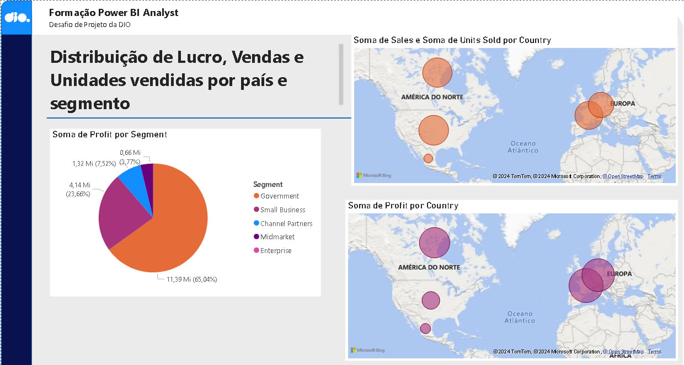

# Desafio Power BI - Módulo 2 DIO

No desafio "Analisando dados de um Dashboard de Vendas no Power BI" do módulo de Fundamentos de Power Bi do Bootcamp "Data Analytics com Power BI" foi proposta a criação de um relatório contendo um gráfico de pizza e dois mapas. O relatório foi inserido num arquivo fornecido durante o curso.

O relatório que foi incluído foi este:

Neste repositório se encontra o arquivo do Power Bi com o relatório novo criado no desafio, juntamente com os dois relatórios já existentes.
